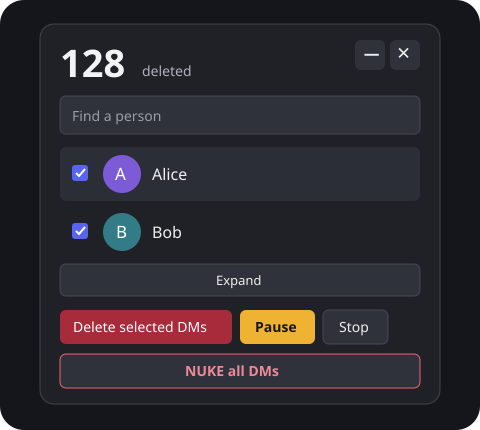

<div align="center">

# Discord DM Nuker

**Deleting DMs one message at a time gets old :c**<br> Select people, queue your messages, minimise it, let it finish.

[](https://github.com/S1MS4/discord-dm-nuker/actions/workflows/ci.yml)
[](discord-dm-panel.js)
[](#quick-start)
[](#limitations)
[](LICENSE)
[](https://github.com/S1MS4/discord-dm-nuker/commits/main)
[](https://github.com/S1MS4/discord-dm-nuker/stargazers)



<sub>Interface illustration. Sample names and count.</sub>

</div>

A single script you paste into Discord's console. No extension, bot account, or runtime dependencies. Still early beta;
fork it if you want to add to the project.

## Before you run it

**Deletions are permanent.** This automates your personal account, which
[Discord prohibits](https://support.discord.com/hc/en-us/articles/115002192352-Automated-User-Accounts-Self-Bots) and
may terminate accounts for. This project is not affiliated with Discord.

It deletes **your ordinary messages and replies** in one-to-one DMs, including attachments on those messages. It cannot
delete the other person's messages.

## Quick start

1. Open Discord in a desktop browser and sign in.
2. Open [discord-dm-panel.js](discord-dm-panel.js), choose **Raw**, and copy the entire script. Review the code before
   running it in your account.
3. Open DevTools → **Console**, paste, and run it.
4. Wait for the DM list. If it stays on **Connecting…**, open another conversation so Discord sends a session request.
5. Check the people you want and click **Delete selected DMs**. That click starts permanent deletion, with no second
   confirmation.

Messages are deleted a page at a time as they are found. You can queue more people while it runs. No full-history
preview required.

**Closing the console is fine.** Keep Discord open. Reloading, navigating away from Discord, or closing its tab/app
loses the in-memory queue. A suspended/background tab may run more slowly.

## Controls

| Control                              | What it does                                                                                           |
| ------------------------------------ | ------------------------------------------------------------------------------------------------------ |
| Checkboxes + **Delete selected DMs** | Queue selected conversations; duplicate active jobs are skipped.                                       |
| **Pause / Resume**                   | Pause requests and continue from the same place.                                                       |
| **Stop**                             | Halt the queue; Resume continues it while this page remains open.                                      |
| **− / +**                            | Minimise to the deleted counter, or restore the controls.                                              |
| **×**                                | Hide the panel. **Deletion continues.**                                                                |
| **Expand / Collapse**                | Change list height. The compact list still scrolls.                                                    |
| **Retry**                            | Appears after an error. Hover the counter for the error message.                                       |
| **NUKE all DMs**                     | Queue every loaded one-to-one DM, including hidden/unselected rows, then hide the panel when finished. |

Drag the counter area to move the panel. Focus it and use arrow keys to move it with the keyboard; hold Shift for larger
steps.

Paste the script again to reopen the same panel, or use:

```javascript
dmScrubPanel.show(); // Reopen
dmScrubPanel.close(); // Hide; keep working
dmScrubPanel.stop = true; // Stop requests
dmScrubPanel.destroy(); // Stop, remove the panel, and release its session data
```

An already-sent request may finish after Stop or destroy. Neither undoes completed deletions.

## How it works

- Lists DMs newest first, then processes selected conversations through one queue.
- Reads up to 100 messages, keeps only messages authored by your account, deletes those, and moves to the next page.
  Only the current page's pending IDs are held for each job.
- Uses Discord's rate-limit headers, shared pacing, and increasing cooldowns after `429` responses. Rate limits pause
  the queue instead of discarding it. There is no rate-limit bypass.
  [Discord's documentation](https://docs.discord.com/developers/topics/rate-limits).
- Retrieves the loaded session token or temporarily observes the next authenticated Discord HTTP request. The observer
  removes itself after capture, cancellation, or timeout. The script does not log credentials or persist them to
  storage.
- Sends API requests to Discord and loads avatars from Discord's CDN. No analytics or third-party backend. Nothing needs
  to be installed to use the script.

## Limitations

- **One-to-one DMs only.** Group DMs, servers, and system entries such as call records are excluded.
- Only conversations returned by Discord's DM-list endpoint are available. Closed or otherwise unlisted DMs may be
  missing.
- Completed conversations are greyed out for that scan. Messages sent after a conversation's scan starts may require a
  fresh run.
- Private Discord internals and endpoints can change. Session capture may fail in some desktop builds; the browser is
  the recommended starting point.
- Offline tests cover the queue and controls. They do not certify compatibility with every live Discord build.

Never include your authorization header, token, cookies, or private DM contents in an issue. A redacted screenshot and
the HTTP status are enough to start debugging.

## Development

Node.js 22+ is only needed for development, not for running the script in Discord.

```bash
npm ci
npm run check
npm test
npm run format:check
```

Tests use simulated Discord responses and a small DOM fixture. They make no live Discord requests and need no account or
token. Coverage includes deletion before the next history page, author filtering, adding jobs mid-run, hide/minimise,
pause/stop/resume, repeated rate limits, retries, session-observer cleanup, and NUKE.

The runtime remains one file so it can be copied straight into the console. `tests/` holds the offline fixture; `docs/`
holds the README illustration. Prettier is the only development dependency. `npm run format` formats the repository.

## Want to help?

Fork it, break the offline fixture, send a pull request. Reproducible client compatibility fixes are especially useful.
Star it if it saved you some clicks :D

## License

MIT, see [LICENSE](LICENSE).
